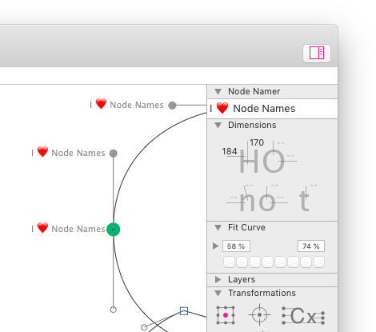

# Node Namer

This is a plugin for the [Glyphs font editor](http://glyphsapp.com/).

*Node Namer* (de: *NodeNamer,* es: *Nombreador de nodos*) is a small item in the Palette sidebar (Cmd-Opt-P) that allows you to set and delete node names.

### Installation

1. One-click install *Node Namer* from *Window > Plugin Manager*
2. Restart Glyphs.

### Usage Instructions

1. Open at least one glyph in Edit View.
2. Select any number of nodes.
3. Set the node names by typing a node name and pressing Return.

### License

Copyright 2020 Rainer Erich Scheichelbauer (@mekkablue).
Based on sample code by Georg Seifert (@schriftgestalt) and Jan Gerner (@yanone).

Licensed under the Apache License, Version 2.0 (the "License");
you may not use this file except in compliance with the License.
You may obtain a copy of the License at

http://www.apache.org/licenses/LICENSE-2.0

See the License file included in this repository for further details.
